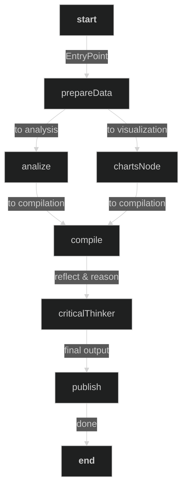

# Alytic

Automated analytics reporting system that generates weekly reports from Google Analytics data and publishes them to Notion.


## Overview

Alytic is a LangGraph-powered workflow that:
- Fetches Google Analytics data
- Analyzes performance against business goals
- Generates charts and visualizations
- Creates executive-style reports in Spanish
- Publishes reports automatically to Notion

## Quick Start

1. Install dependencies:
```bash
npm install
```

2. Set up environment variables in `.env`:
```
OPENAI_KEY=your_openai_api_key

```

3. Run the server:
```bash
npm run dev
```

4. Trigger a report via API:
```bash
POST /run-report
Headers: x-api-key: your_internal_api_key
Body: {
  "userId": "user_id",
  "notionAccessToken": "notion_token",
  "gaAccessToken": "ga_token",
  "gaRefreshToken": "ga_refresh_token",
  "gaPropertyId": "ga_property_id"
}
```

## Architecture

The system uses a LangGraph workflow with these nodes:
- **PrepareData**: Fetches GA data and business goals
- **Analyze**: AI analysis of performance data
- **ChartsNode**: Generates visualization charts
- **Compile**: Creates markdown report
- **CriticalThinker**: Translates to Spanish
- **Publish**: Posts to Notion

## Tech Stack

- LangGraph.js for workflow orchestration
- OpenAI GPT-4 for analysis and copywriting
- Google Analytics Data API
- Notion API for publishing
- Supabase for user data
- Trigger.dev for task scheduling
